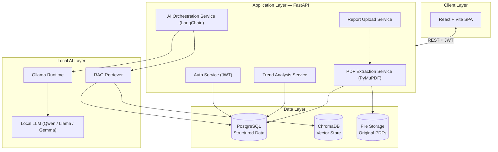
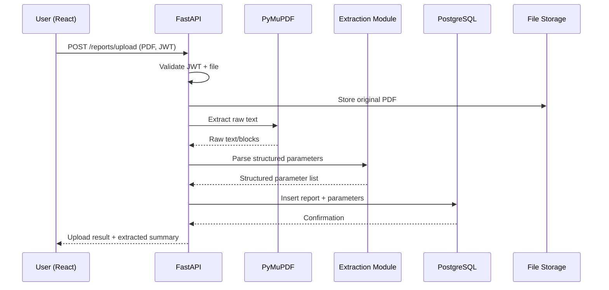
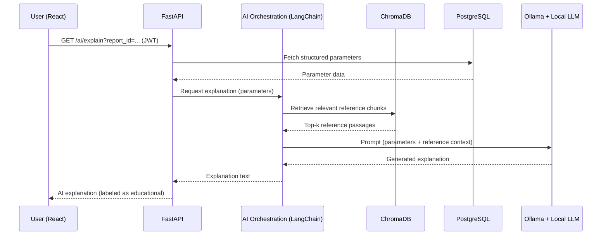
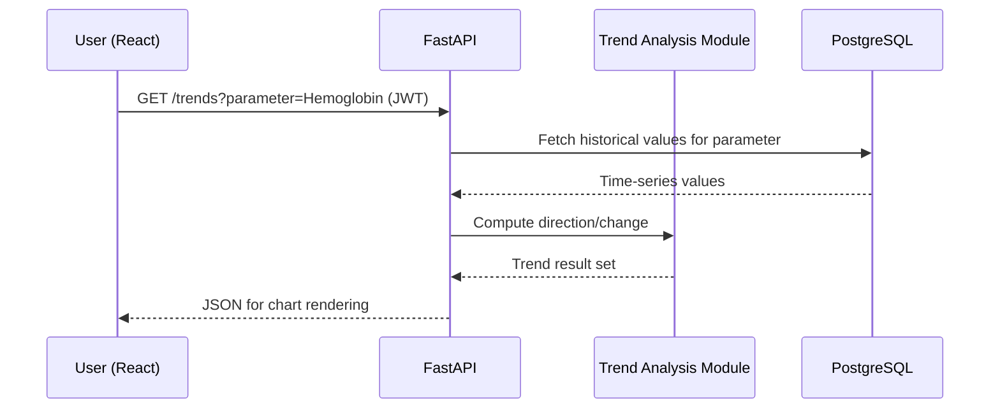
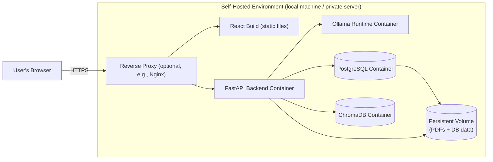

# VitaLens — Technical Architecture Document

**Document:** 02_ARCHITECTURE.md
**Version:** 1.0
**Status:** Draft
**Based On:** VitaLens PRD v1.0

---

## 1. Architecture Overview 

VitaLens follows a **layered, service-oriented monolith** architecture: a single FastAPI backend exposing a REST API, backed by PostgreSQL for structured data and ChromaDB for vector-based retrieval, with a React (Vite) single-page application as the client. AI functionality (explanations, summaries, discussion questions) is handled by a distinct, clearly bounded subsystem that orchestrates retrieval-augmented generation (RAG) through LangChain against a locally hosted LLM served by Ollama. 

The architecture is deliberately kept as a **modular monolith** rather than a microservices system. This is realistic and appropriate for a final-year project: it minimizes operational overhead (no service mesh, no distributed transactions) while still enforcing clean separation of concerns internally, so the system remains readable, testable, and defensible in an academic evaluation.

Two data flows exist side by side and never overlap in responsibility:

1. **Deterministic flow** — upload, parsing, extraction, storage, trend calculation. No LLM involved. Fully predictable and testable.
2. **AI-assisted flow** — explanation, summarization, and question generation. LLM-involved, non-deterministic by nature, always clearly labeled as AI-generated and educational in the UI.

---

## 2. High-Level Architecture



**Key principle:** all arrows into the AI Layer originate only from the AI Orchestration Service. No other backend service talks to Ollama or ChromaDB directly. This keeps the "deterministic" and "AI-assisted" flows cleanly separated.

---

## 3. System Components

| Component | Technology | Role |
|---|---|---|
| Client Application | React + Vite | Single-page app; all user interaction, charts, forms |
| API Gateway / Backend | FastAPI | Single REST API surface; routes, validation, orchestration |
| Auth Module | FastAPI + JWT | Registration, login, token issuance/validation |
| PDF Processing Module | PyMuPDF | Text extraction from uploaded PDF reports |
| Parameter Extraction Module | Python (regex/rule-based, backend logic) | Converts raw PDF text into structured parameter records |
| Trend Analysis Module | Python (backend logic) | Computes historical changes/direction from stored parameters |
| AI Orchestration Module | LangChain | Coordinates retrieval + prompt construction + LLM invocation |
| Retrieval Layer | ChromaDB | Stores/retrieves reference knowledge (parameter definitions, medical glossary chunks) used to ground LLM output |
| LLM Runtime | Ollama | Serves the local open-source LLM over a local API |
| LLM | Qwen / Llama / Gemma (open-source, self-hosted) | Generates explanations, summaries, discussion questions |
| Relational Database | PostgreSQL | System of record: users, reports, parameters, metadata |
| File Storage | Local/self-hosted filesystem (or volume) | Stores original uploaded PDF files |

---

## 4. Component Responsibilities

### 4.1 Frontend (React + Vite)
- Renders dashboard, upload screen, report history, trend charts, and AI-generated content.
- Manages JWT token storage (in memory / secure storage) and attaches it to API requests.
- Performs client-side validation (file type/size) before upload.
- Contains **no business logic** related to extraction, trend computation, or AI reasoning — it only displays what the backend returns.

### 4.2 Backend (FastAPI)
- Exposes REST endpoints grouped by domain: `auth`, `reports`, `parameters`, `trends`, `ai`.
- Enforces authentication/authorization on all protected routes.
- Hosts the deterministic pipeline (upload → parse → extract → store) as plain Python services — no LLM involvement.
- Hosts the AI orchestration layer as a **separate internal module** that is invoked only for explanation/summary/question endpoints.
- Owns all validation, error handling, and logging.

### 4.3 PDF Processing (PyMuPDF)
- Opens uploaded PDF files and extracts raw text (and, where feasible, layout/positional information to assist parameter parsing).
- Returns raw text/blocks to the Parameter Extraction Module; performs no interpretation itself.

### 4.4 Parameter Extraction Module
- Applies rule-based/pattern-matching logic (e.g., known parameter name dictionaries, regex for `value + unit + reference range` patterns) to convert raw text into structured rows.
- Flags low-confidence or unmatched lines for user review rather than silently guessing.
- This module is **entirely deterministic backend logic** — no LLM is used here, since parameter extraction must be reliable and auditable.

### 4.5 AI Orchestration Module (LangChain)
- Builds the context for a given AI task (explanation, summary, or discussion questions) by combining:
  - Structured parameter data retrieved from PostgreSQL.
  - Relevant reference text retrieved from ChromaDB (RAG step).
- Constructs a task-specific prompt with an explicit instruction to remain educational/non-diagnostic.
- Sends the prompt to Ollama and returns the generated text to the API layer.
- This is the **only** module in the system that touches the LLM.

### 4.6 Ollama + Local LLM
- Ollama runs as a local inference server hosting an open-source model (Qwen, Llama, or Gemma family).
- Receives fully-formed prompts from LangChain; has no direct access to the database or filesystem.

### 4.7 PostgreSQL
- System of record for all structured, relational data: users, reports (metadata), extracted parameters, trend-relevant history.
- Source of truth for anything that must be exact, queryable, and consistent.

### 4.8 ChromaDB
- Stores vector embeddings of **reference/educational content** (e.g., descriptions of what each blood parameter means, general reference-range context) used to ground LLM responses via similarity search.
- Does **not** store user medical data as its primary purpose — see Section 8 for the precise division of responsibility.

---

## 5. Data Flow

### 5.1 Deterministic Flow (Upload → Storage)



### 5.2 AI-Assisted Flow (Explanation / Summary / Questions)



### 5.3 Trend Analysis Flow



---

## 6. Blood Report Processing Pipeline

The pipeline is intentionally deterministic end-to-end (no LLM), to ensure extraction is reliable, testable, and debuggable:

1. **Upload & Validation** — File type (`application/pdf`) and size are validated before processing begins.
2. **Storage of Original** — The raw PDF is persisted to file storage, referenced by a report record in PostgreSQL.
3. **Text Extraction (PyMuPDF)** — Raw text and layout blocks are extracted page by page.
4. **Parameter Identification** — A rule-based parser matches known parameter name patterns (e.g., "Hemoglobin", "WBC Count", "Creatinine") against extracted text, capturing value, unit, and reference range using pattern rules.
5. **Confidence Flagging** — Lines that cannot be confidently matched are marked `unparsed` and surfaced to the user for manual review, rather than being dropped or guessed by an LLM.
6. **Structured Persistence** — Confirmed parameters are written to PostgreSQL as structured rows linked to the report and user.
7. **Pipeline Completion** — The report status is updated to `processed`, making it available for explanation, trend analysis, and comparison.

This pipeline has **no dependency on Ollama, LangChain, or ChromaDB** — a design choice that keeps the core data integrity of the system independent of LLM availability or quality.

---

## 7. AI/RAG Pipeline

The AI pipeline is invoked only for three feature categories: **report explanation**, **AI health summary**, and **doctor discussion questions**. All three share the same underlying orchestration pattern:

1. **Context Assembly** — The AI Orchestration Module fetches the relevant structured data from PostgreSQL (e.g., a report's parameters, or two reports' parameters for a comparison).
2. **Retrieval (RAG)** — LangChain queries ChromaDB for the most relevant reference passages (e.g., plain-language definitions of the parameters in question, general context on reference ranges) using vector similarity search.
3. **Prompt Construction** — LangChain assembles a structured prompt combining:
   - The user's structured parameter data (facts).
   - Retrieved reference passages (grounding).
   - A fixed system instruction enforcing educational tone and explicitly prohibiting diagnostic or prescriptive language.
4. **Local Inference** — The prompt is sent to Ollama, which runs the selected open-source model (Qwen/Llama/Gemma) entirely on local/self-hosted infrastructure.
5. **Post-Processing** — The raw model output is returned to the API layer, wrapped with a standard educational disclaimer, and attached to the response payload.
6. **Delivery** — FastAPI returns the generated content to the frontend, which visually distinguishes AI-generated content (e.g., labeled section, disclaimer banner) from deterministic data.

**Design constraint enforced throughout:** the LLM never receives raw file uploads and never writes directly to PostgreSQL. It only receives curated, backend-assembled context and returns text. This keeps LLM behavior contained and auditable.

---

## 8. Database Architecture

VitaLens uses **two data stores with distinct, non-overlapping responsibilities**:

### 8.1 PostgreSQL — System of Record
Stores all data that must be exact, relational, user-scoped, and queryable:
- `users` — account credentials (hashed), profile info.
- `reports` — metadata per uploaded report (upload date, file reference, processing status).
- `parameters` — structured extracted values (name, value, unit, reference range, report link).
- Any comparison/trend computation reads directly from this structured, relational data.

PostgreSQL is the **single source of truth** for anything the system must get exactly right — it is never approximate and never involves similarity search.

### 8.2 ChromaDB — Reference Knowledge Retrieval
Stores **vector embeddings of reference/educational content**, not primary user medical records:
- Embeddings of parameter glossary text (e.g., "what is MCHC", "what does elevated ALT typically indicate in general educational terms").
- Used exclusively to retrieve grounding context for the LLM during the RAG step.
- Queried by similarity search (semantic relevance), not by exact match.

### 8.3 Why the Split Matters
| Concern | PostgreSQL | ChromaDB |
|---|---|---|
| Data type | Structured, relational | Unstructured text embeddings |
| Query style | Exact match / relational joins | Semantic similarity search |
| Source of truth for user data | Yes | No |
| Used for trend/chart computation | Yes | No |
| Used for grounding AI explanations | No (only supplies raw facts) | Yes |
| Sensitivity | Contains user medical data — access-controlled per user | Contains only general reference knowledge, not user-specific records |

This separation keeps user-identifiable medical data out of the vector store entirely, simplifying the privacy story: ChromaDB never needs to store or expose any individual's report values.

---

## 9. Authentication Architecture

- **Mechanism:** JSON Web Tokens (JWT), issued on successful login.
- **Password Storage:** Passwords are hashed (e.g., bcrypt) before persistence; plaintext passwords are never stored or logged.
- **Token Flow:**
  1. User registers or logs in via `POST /auth/register` or `POST /auth/login`.
  2. On success, the backend issues a signed JWT (short-to-medium expiry) containing the user ID as claim.
  3. The frontend attaches the JWT as a `Bearer` token on the `Authorization` header for all subsequent requests.
  4. FastAPI dependency-injected middleware validates the token's signature and expiry on every protected route before the request reaches business logic.
- **Authorization Scope:** All data-access queries (reports, parameters, trends, AI features) are scoped to the authenticated user's ID at the query level — no user can access another user's records via the API.
- **Token Expiry & Refresh:** Access tokens expire after a defined window; re-authentication (or a refresh flow, if implemented) is required afterward. Kept simple by design for MVP scope.

---

## 10. API Layer

FastAPI exposes a single versioned REST API (e.g., `/api/v1/...`), organized by domain router:

| Router | Example Endpoints | LLM Involved? |
|---|---|---|
| `auth` | `POST /auth/register`, `POST /auth/login` | No |
| `reports` | `POST /reports/upload`, `GET /reports`, `GET /reports/{id}`, `DELETE /reports/{id}` | No |
| `parameters` | `GET /reports/{id}/parameters` | No |
| `trends` | `GET /trends?parameter=...` | No |
| `ai` | `GET /ai/explain/{report_id}`, `GET /ai/summary?from=...&to=...`, `GET /ai/questions/{report_id}` | Yes |

**Design conventions:**
- All routes (except `auth/register` and `auth/login`) require a valid JWT.
- Deterministic routers (`reports`, `parameters`, `trends`) depend only on PostgreSQL/file storage services.
- The `ai` router is the sole entry point into the AI Orchestration Module — this is enforced structurally (only `ai`-domain endpoints import the orchestration service).
- Responses use consistent JSON envelopes with clear status/error fields; AI-generated fields are explicitly tagged (e.g., `"source": "ai_generated"`) so the frontend can render appropriate disclaimers.

---

## 11. Frontend Architecture

- **Framework:** React with Vite as the build tool/dev server.
- **Structure (feature-based):**
  - `pages/` — Dashboard, Upload, ReportHistory, ReportDetail, Trends, Login/Register.
  - `components/` — reusable UI elements (charts, cards, upload widget, disclaimer banner).
  - `services/` — API client modules (one per backend domain: auth, reports, trends, ai) wrapping `fetch`/`axios` calls with JWT attached.
  - `context/` (or lightweight state library) — holds auth state (current user, token) and exposes it app-wide.
  - `hooks/` — data-fetching hooks per domain (e.g., `useReports`, `useTrends`).
- **Charting:** An interactive charting library (e.g., Recharts or Chart.js) renders trend graphs, with reference-range bands overlaid.
- **AI Content Presentation:** All AI-generated text (explanations, summaries, questions) is rendered in visually distinct components with a persistent educational disclaimer, keeping it clearly separated from deterministic report data.
- **Routing:** Client-side routing (React Router) gates authenticated pages behind a route guard that checks for a valid token.

---

## 12. Backend Architecture

FastAPI backend follows a **layered structure** within the modular monolith:

```
app/
├── api/                # Route definitions (routers), one module per domain
│   ├── auth.py
│   ├── reports.py
│   ├── parameters.py
│   ├── trends.py
│   └── ai.py
├── services/            # Business logic layer
│   ├── auth_service.py
│   ├── extraction_service.py   # PyMuPDF + parsing logic
│   ├── trend_service.py
│   └── ai_orchestration_service.py   # LangChain + Ollama + ChromaDB calls
├── models/              # SQLAlchemy ORM models (User, Report, Parameter)
├── schemas/             # Pydantic request/response schemas
├── db/                  # DB session/config, migrations (Alembic)
├── core/                # Config, security (JWT), logging
└── main.py              # App entrypoint
```

**Layering rules:**
- Routers (`api/`) contain no business logic — they validate input, call a service, and return a response.
- Services (`services/`) contain all business logic and are the only layer that talks to the database, filesystem, or AI subsystem.
- `ai_orchestration_service.py` is the **only** service permitted to import LangChain/Ollama clients — this is a deliberate boundary to keep AI-dependent code isolated and swappable.
- Database access goes through SQLAlchemy models/sessions; no raw SQL scattered across routers.

---

## 13. Security & Privacy Architecture

- **Data Locality:** All report data, extracted parameters, and AI inference remain on self-hosted infrastructure (local machine or private server). No report content, parameter data, or user information is transmitted to any external/cloud API.
- **Authentication:** JWT-based; all protected endpoints validate tokens before processing.
- **Password Security:** Passwords hashed with a strong algorithm (bcrypt/argon2); never logged or stored in plaintext.
- **File Upload Safety:** Uploaded files are validated for type/size and processed in a controlled manner to reduce risk from malformed or malicious PDFs.
- **User Data Isolation:** Every data-access query is scoped by the authenticated user's ID; no cross-user data access is possible through the API.
- **AI Content Safety:** System prompts sent to the LLM explicitly instruct it to avoid diagnostic/prescriptive language; all AI output is labeled and disclaimed in the UI.
- **Least Privilege for AI Layer:** The LLM (via Ollama) has no direct access to the database, filesystem, or network beyond receiving prompts and returning text — it operates purely as a text-generation function called by the backend.
- **Transport Security:** In deployment, HTTPS/TLS should terminate in front of the FastAPI service (see Section 14).

---

## 14. Deployment Architecture

Designed for realistic, self-hosted deployment suitable for a final-year project demo (local machine, university lab server, or a single private VM) — not a distributed cloud-native deployment.



- **Containerization:** Each component (FastAPI backend, PostgreSQL, ChromaDB, Ollama) runs as a separate Docker container, orchestrated via Docker Compose for local/single-host deployment.
- **Frontend Delivery:** The React app is built as static assets and served either via the reverse proxy or a lightweight static file server.
- **Persistence:** A mounted volume persists PostgreSQL data and stored PDF files across container restarts.
- **No Cloud Dependency:** Nothing in the deployment requires an external cloud AI service; Ollama and the LLM run entirely within the host environment.
- **Environment Configuration:** Secrets (JWT signing key, DB credentials) are supplied via environment variables/`.env`, not hardcoded.

---

## 15. Technology Decisions and Rationale

| Decision | Rationale |
|---|---|
| **FastAPI over Django/Flask** | Async-first, strong typing via Pydantic, automatic OpenAPI docs — well suited for a clean API-first architecture and fast development. |
| **PostgreSQL over NoSQL** | Blood parameter data is inherently structured and relational (users → reports → parameters); relational integrity and querying for trends benefit from SQL. |
| **JWT over session-based auth** | Stateless authentication simplifies scaling the API layer and fits a decoupled SPA + API architecture. |
| **PyMuPDF for PDF processing** | Fast, reliable text/layout extraction from PDFs without external service dependency; well-suited for lab report formats. |
| **LangChain for AI orchestration** | Provides structured abstractions for RAG (retrieval + prompt assembly) rather than hand-rolling prompt/context management. |
| **Ollama for local inference** | Simplifies running open-source LLMs locally with a consistent local API, satisfying the hard constraint of no cloud LLM APIs. |
| **ChromaDB for vector storage** | Lightweight, easy to self-host, integrates directly with LangChain — appropriate scale for a reference-knowledge retrieval use case (not a massive production vector store). |
| **Modular monolith over microservices** | Reduces operational complexity (no service discovery, no distributed tracing needed) while the internal service-layer boundaries still enforce separation of concerns — appropriate for project scope and team size. |
| **Two-database split (PostgreSQL + ChromaDB)** | Cleanly separates exact, user-owned structured data from approximate, general-purpose reference retrieval — avoids conflating "facts" with "grounding context." |

---

## 16. Future Scalability Considerations

These are **not** part of the MVP but represent realistic extension points if the project were to grow beyond its academic scope:

- **Service Extraction:** The AI Orchestration Module could be split into an independent microservice if inference load grows, communicating with the core backend over an internal API.
- **Model Flexibility:** Ollama's model-swapping capability would allow trialing different open-source models (larger Qwen/Llama variants) without changing the orchestration layer.
- **Asynchronous Processing:** Long-running PDF extraction or LLM generation could move to a task queue (e.g., Celery/RQ with Redis) to avoid blocking API requests, with the frontend polling or using websockets for status updates.
- **Horizontal Scaling:** The FastAPI backend is stateless (JWT-based), so multiple backend instances could be run behind a load balancer if concurrent usage increased.
- **Caching Layer:** Frequently retrieved reference embeddings or repeated AI explanations could be cached to reduce redundant LLM calls.
- **OCR Integration:** Support for scanned/image-based PDFs could be added as a pre-processing step before the existing PyMuPDF pipeline, without altering downstream extraction logic.
- **Managed Vector Store:** ChromaDB could be swapped for a more scalable vector database (e.g., Qdrant, pgvector within PostgreSQL) if reference knowledge grows significantly, without changing the RAG pipeline's logical design.

---

*End of Document*
