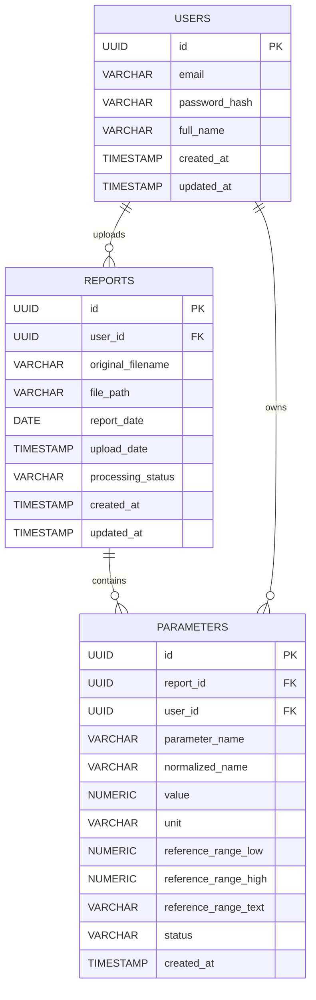

# VitaLens — Database Architecture Document

**Document:** 03_DATABASE.md
**Version:** 1.0
**Status:** Draft
**Based On:** VitaLens PRD v1.0, 02_ARCHITECTURE.md

---

## 1. Database Overview

VitaLens uses **PostgreSQL** as its sole relational database and system of record for all structured, user-owned data: accounts, report metadata, and extracted blood parameters. PostgreSQL is responsible for every piece of data that must be exact, queryable, relationally consistent, and scoped to a specific user.

This document defines the minimum set of tables required to support the MVP functional requirements: account management, report storage/tracking, parameter extraction, report history, and trend analysis. No speculative or "might be useful later" tables are included — every table maps directly to a stated MVP requirement.

Original PDF files themselves are **not** stored in PostgreSQL; only a reference (file path/identifier) to the file in file storage is kept, consistent with the architecture decision in `02_ARCHITECTURE.md`.

---

## 2. Database Design Principles

1. **Minimalism** — Only tables directly required by confirmed MVP features are created. No provisioning for hypothetical future features.
2. **Single Source of Truth** — PostgreSQL holds the authoritative version of every structured fact about a user's reports and parameters. ChromaDB never holds user medical data (see Section 14).
3. **Strict User Isolation** — Every row that belongs to a user is traceable back to that user via a foreign key, and every query in the application layer is scoped by `user_id`.
4. **Normalization Without Over-Engineering** — The schema is normalized to third normal form (3NF) for the core entities (users, reports, parameters), without introducing lookup tables that aren't needed for the MVP (e.g., no separate "parameter catalog" table — see Section 9 for the rationale).
5. **Deterministic, LLM-Independent Design** — The schema exists entirely to serve deterministic backend logic (extraction, storage, trend computation). The LLM never reads from or writes to PostgreSQL directly; it only receives data that the backend has already queried and assembled (per `02_ARCHITECTURE.md`, Section 7).
6. **Auditability** — Timestamps (`created_at`, `updated_at`) are included on core tables to support debugging, history tracking, and future auditing needs.

---

## 3. Entity Relationship Overview

The MVP requires exactly **three core tables**: `users`, `reports`, and `parameters`. This is the minimum structure capable of supporting registration/login, report upload/storage/history, parameter extraction, and trend/comparison analysis, with clean user isolation throughout.

---

## 4. Tables and Their Purpose

| Table | Purpose |
|---|---|
| `users` | Stores account credentials and identity information for authentication (JWT-based) and data ownership. |
| `reports` | Stores metadata for each uploaded blood report: who uploaded it, when, its processing status, and a reference to the stored PDF file. |
| `parameters` | Stores each individual structured blood parameter extracted from a report (e.g., Hemoglobin, WBC Count), linked to both the report and the owning user, forming the basis for explanations, comparisons, and trend charts. |

No additional tables (e.g., sessions, roles, notifications, audit logs) are introduced, as none are required by the confirmed MVP scope.

---

## 5. Detailed Table Schemas

### 5.1 `users`

| Column | Data Type | Constraints | Description |
|---|---|---|---|
| `id` | `UUID` | `PRIMARY KEY`, `DEFAULT gen_random_uuid()` | Unique identifier for the user. |
| `email` | `VARCHAR(255)` | `NOT NULL`, `UNIQUE` | User's email address; used as login identifier. |
| `password_hash` | `VARCHAR(255)` | `NOT NULL` | Securely hashed password (bcrypt/argon2). Plaintext passwords are never stored. |
| `full_name` | `VARCHAR(150)` | `NOT NULL` | User's display name, used in the UI. |
| `created_at` | `TIMESTAMPTZ` | `NOT NULL`, `DEFAULT now()` | Timestamp of account creation. |
| `updated_at` | `TIMESTAMPTZ` | `NOT NULL`, `DEFAULT now()` | Timestamp of last profile update. |

---

### 5.2 `reports`

| Column | Data Type | Constraints | Description |
|---|---|---|---|
| `id` | `UUID` | `PRIMARY KEY`, `DEFAULT gen_random_uuid()` | Unique identifier for the report. |
| `user_id` | `UUID` | `NOT NULL`, `FOREIGN KEY → users(id)`, `ON DELETE CASCADE` | Owner of this report. |
| `original_filename` | `VARCHAR(255)` | `NOT NULL` | Original filename of the uploaded PDF, as provided by the user. |
| `file_path` | `VARCHAR(500)` | `NOT NULL` | Reference/path to the stored PDF in file storage (not the file content itself). |
| `report_date` | `DATE` | `NULL` | The date the blood test was performed, as stated on the report (used as the x-axis for trend analysis). May be `NULL` if not extractable, falling back to `upload_date`. |
| `upload_date` | `TIMESTAMPTZ` | `NOT NULL`, `DEFAULT now()` | Timestamp when the file was uploaded to VitaLens. |
| `processing_status` | `VARCHAR(20)` | `NOT NULL`, `DEFAULT 'pending'`, `CHECK (processing_status IN ('pending','processing','processed','failed'))` | Current state of the extraction pipeline for this report. |
| `created_at` | `TIMESTAMPTZ` | `NOT NULL`, `DEFAULT now()` | Row creation timestamp. |
| `updated_at` | `TIMESTAMPTZ` | `NOT NULL`, `DEFAULT now()` | Timestamp of last update (e.g., status change). |

---

### 5.3 `parameters`

| Column | Data Type | Constraints | Description |
|---|---|---|---|
| `id` | `UUID` | `PRIMARY KEY`, `DEFAULT gen_random_uuid()` | Unique identifier for the extracted parameter row. |
| `report_id` | `UUID` | `NOT NULL`, `FOREIGN KEY → reports(id)`, `ON DELETE CASCADE` | The report this parameter value was extracted from. |
| `user_id` | `UUID` | `NOT NULL`, `FOREIGN KEY → users(id)`, `ON DELETE CASCADE` | Denormalized owner reference (see Section 8) to enforce and simplify user isolation. |
| `parameter_name` | `VARCHAR(150)` | `NOT NULL` | The parameter name exactly as extracted from the report (e.g., "Hemoglobin", "Hb"). |
| `normalized_name` | `VARCHAR(150)` | `NOT NULL` | A standardized version of the parameter name (e.g., "hemoglobin") used to group the same parameter across differently-formatted reports for trend analysis. |
| `value` | `NUMERIC(10,3)` | `NULL` | The numeric value of the parameter. `NULL` permitted for values that could not be confidently parsed. |
| `unit` | `VARCHAR(30)` | `NULL` | Unit of measurement (e.g., "g/dL", "cells/mcL"). |
| `reference_range_low` | `NUMERIC(10,3)` | `NULL` | Lower bound of the normal reference range, if parsed. |
| `reference_range_high` | `NUMERIC(10,3)` | `NULL` | Upper bound of the normal reference range, if parsed. |
| `reference_range_text` | `VARCHAR(100)` | `NULL` | Raw reference range text as it appeared on the report (fallback when a clean numeric range cannot be parsed, e.g., "Negative" or "4.5–5.5"). |
| `status` | `VARCHAR(20)` | `NOT NULL`, `DEFAULT 'unparsed'`, `CHECK (status IN ('normal','low','high','unparsed'))` | Derived status of the value relative to its reference range; `'unparsed'` flags rows requiring user review (per FR-5.3). |
| `created_at` | `TIMESTAMPTZ` | `NOT NULL`, `DEFAULT now()` | Timestamp when this parameter row was created during extraction. |

---

## 6. Primary Keys and Foreign Keys

| Table | Primary Key | Foreign Keys |
|---|---|---|
| `users` | `id` | — |
| `reports` | `id` | `user_id → users(id)` |
| `parameters` | `id` | `report_id → reports(id)`, `user_id → users(id)` |

All primary keys use `UUID` (rather than sequential integers) to avoid exposing enumerable identifiers through the API and to keep identifiers safely generatable outside the database if ever needed (e.g., during file naming before insert).

All foreign keys use `ON DELETE CASCADE`: deleting a user removes all their reports and parameters; deleting a report removes its associated parameters. This keeps the data model consistent with FR-4.3 (users can delete their own reports) without leaving orphaned rows.

---

## 7. Relationships Between Tables

- **`users` → `reports`**: One-to-many. A user can upload many reports; each report belongs to exactly one user.
- **`reports` → `parameters`**: One-to-many. A single report produces many extracted parameter rows (e.g., one report yields 20+ parameter rows for a full blood panel); each parameter row belongs to exactly one report.
- **`users` → `parameters`**: One-to-many (denormalized). Each parameter row also references its owning user directly, in addition to its report, to support efficient, isolation-safe querying (see Section 8).

There is intentionally **no many-to-many relationship** anywhere in the schema — the domain (a user uploads reports, each containing parameters) is strictly hierarchical, and modeling it as such keeps queries simple and avoids unnecessary join tables.

---

## 8. User Data Isolation

User isolation is enforced at two levels:

1. **Schema Level:** Every table that stores user-owned data (`reports`, `parameters`) carries a `user_id` foreign key back to `users`. In `parameters`, `user_id` is **intentionally denormalized** (in addition to `report_id`) so that:
   - Every query for "this user's parameters" can filter directly on `parameters.user_id` without requiring a join through `reports` on every request.
   - Row-level access control checks are simpler and less error-prone (a missing join condition cannot accidentally leak cross-user data).

2. **Application Level:** Per `02_ARCHITECTURE.md` (Section 9 — Authentication Architecture), every API request is authenticated via JWT, and every database query issued by the backend is scoped with a `WHERE user_id = :current_user_id` condition (or an equivalent ORM filter). No endpoint queries `reports` or `parameters` without this scope.

Together, these ensure that no user can access, view, or modify another user's reports or parameters, whether through a backend bug in join logic or direct query construction.

---

## 9. Report and Parameter Data Model

- A **report** represents one uploaded PDF and its processing metadata. It does not itself contain parameter values — those live in the related `parameters` rows.
- A **parameter** represents a single measured value from a report (e.g., "Hemoglobin: 13.5 g/dL, range 13.0–17.0"). A single report typically produces many parameter rows.
- **Why no separate "parameter catalog/reference" table:** Extracted parameter names (`parameter_name`) can vary in formatting across labs (e.g., "Hemoglobin" vs. "Hb" vs. "HGB"). Rather than introducing a separate lookup/catalog table to canonicalize these (which would require ongoing maintenance of a master parameter list — a scope addition not required by the MVP), the schema uses a single `normalized_name` column populated by the backend's extraction logic at write time. This is sufficient to group the same parameter across reports for trend analysis (Section 10) without adding a fourth table. If parameter catalog management becomes a real need, it is captured as a future consideration (Section 16).
- **Why reference range is split into `low`/`high` plus a `text` fallback:** Most reference ranges are numeric (e.g., 13.0–17.0), which enables direct comparison and chart rendering. Some ranges are non-numeric (e.g., "Negative", "Non-reactive"); `reference_range_text` preserves these cases without forcing them into numeric columns.

---

## 10. Historical Data and Trend Analysis

Trend analysis (FR-8.1, FR-8.2) and interactive charts (FR-9.1–9.3) are computed entirely from data already present in `reports` and `parameters` — no separate "history" or "trends" table is needed, since the existing schema already stores every report a user has ever uploaded.

**Trend query pattern:**
1. Filter `parameters` by `user_id` and `normalized_name` (e.g., all "hemoglobin" rows for the current user).
2. Join to `reports` to obtain `report_date` (falling back to `upload_date` where `report_date` is `NULL`) for chronological ordering.
3. Order results by date ascending.
4. Backend logic (per `02_ARCHITECTURE.md`, Section 4.4 — Trend Analysis Module) computes the direction of change between consecutive values (increasing/decreasing/stable) and packages the time series for the frontend chart.

**Report comparison** (used in AI Health Summary generation) follows the same pattern but is bounded to exactly two `report_id`s selected by the user, diffing their respective `parameters` rows by `normalized_name`.

Because every report and parameter row is retained indefinitely (no overwriting of prior values), the full historical record is always available for trend computation — this is a natural consequence of the one-to-many `reports → parameters` design, not a separate feature.

---

## 11. Indexing Strategy

| Table | Index | Rationale |
|---|---|---|
| `users` | Unique index on `email` | Enforces uniqueness and speeds up login lookups. |
| `reports` | Index on `user_id` | Supports "list all reports for this user" queries (dashboard, history). |
| `reports` | Index on `(user_id, report_date)` | Supports chronological retrieval of a user's reports for history/trend views. |
| `parameters` | Index on `report_id` | Supports "get all parameters for this report" (report detail view). |
| `parameters` | Index on `(user_id, normalized_name, created_at)` | Supports the core trend-analysis query pattern: fetch a specific parameter's history for a user, ordered by time. |
| `parameters` | Index on `user_id` | Supports isolation-scoped queries not filtered by a specific parameter. |

Primary keys (`id` columns) are automatically indexed by PostgreSQL via their `UNIQUE` constraint; no additional action is needed for those.

---

## 12. Data Integrity and Constraints

- **Referential Integrity:** All foreign keys (`reports.user_id`, `parameters.report_id`, `parameters.user_id`) are enforced with `ON DELETE CASCADE`, preventing orphaned rows.
- **Not-Null Constraints:** Core identifying and ownership columns (`user_id`, `report_id`, `email`, `password_hash`, `parameter_name`, `normalized_name`) are `NOT NULL`, ensuring no incomplete ownership or identity records can exist.
- **Enumerated Status Values:** `reports.processing_status` and `parameters.status` use `CHECK` constraints restricting values to a fixed, known set, preventing invalid or free-text status values from being written.
- **Unique Email:** `users.email` is unique, preventing duplicate accounts on the same email.
- **Numeric Precision:** `value`, `reference_range_low`, and `reference_range_high` use `NUMERIC(10,3)` rather than floating-point types, avoiding floating-point rounding issues for medical values.
- **Nullable Extraction Fields:** Fields that may legitimately fail to parse (`value`, `unit`, `reference_range_low/high`, `report_date`) are nullable by design, with `status = 'unparsed'` used to flag such rows for user review rather than rejecting the row outright — consistent with FR-5.3.

---

## 13. Sensitive Data Considerations

- **Passwords:** Only `password_hash` is stored; plaintext passwords are never persisted, logged, or transmitted beyond the initial login/registration request.
- **Medical Data Scope:** `parameters` holds structured medical values (blood test results). Access to this table is strictly gated by JWT-authenticated, user-scoped queries (Section 8); there is no admin/global read endpoint in the MVP scope.
- **File Content vs. Metadata:** The original PDF (which may contain additional identifying information such as patient name, lab name, or address as printed by the lab) is **not** stored in PostgreSQL — only `file_path` and `original_filename` are. The file itself resides in file storage, keeping the database free of embedded document content.
- **No Storage of Data in ChromaDB:** As stated in Section 14, no row from `users`, `reports`, or `parameters` is ever written to ChromaDB. This means a compromise or inspection of the vector store cannot expose any individual's medical data.
- **Deletion:** Cascading deletes ensure that when a user deletes a report (FR-4.3) or their account, all associated parameter data is fully removed from PostgreSQL — no residual rows persist.

---

## 14. PostgreSQL vs. ChromaDB Responsibility

| Aspect | PostgreSQL | ChromaDB |
|---|---|---|
| **Primary role** | System of record for user accounts, reports, and extracted parameters | Retrieval index for general reference/educational content used in RAG |
| **Data owned** | `users`, `reports`, `parameters` (as defined in this document) | Vector embeddings of parameter glossary/reference text (not defined in this document — owned by the AI subsystem) |
| **Contains user medical data?** | Yes — this is its purpose | No — by design, per architecture decision |
| **Query style** | Exact match, relational joins, ordering (SQL) | Semantic similarity search (vector distance) |
| **Used for trend analysis?** | Yes — sole source | No |
| **Used for AI explanation grounding?** | Supplies the factual parameter data (queried by the backend, then passed into the AI orchestration layer) | Supplies general reference passages retrieved via similarity search |
| **Written to by the LLM?** | Never | Never (populated ahead of time from reference content, not from user interactions) |

This document defines only the PostgreSQL schema. ChromaDB's internal structure (collections, embedding schema) is out of scope here, as it stores no data described by this document's tables — it is populated from independent, non-user-specific reference material and is covered under the AI/RAG pipeline in `02_ARCHITECTURE.md`.

---

## 15. Example Data Flow

**Scenario:** A user uploads a second blood report and views their hemoglobin trend.

1. `POST /reports/upload` creates a new row in `reports`:
   `{ id: R2, user_id: U1, original_filename: "report_aug2026.pdf", file_path: "...", processing_status: "pending" }`
2. PyMuPDF + extraction service parse the PDF; for each identified value, a row is inserted into `parameters`, e.g.:
   `{ id: P101, report_id: R2, user_id: U1, parameter_name: "Hemoglobin", normalized_name: "hemoglobin", value: 13.8, unit: "g/dL", reference_range_low: 13.0, reference_range_high: 17.0, status: "normal" }`
3. `reports.processing_status` for `R2` is updated to `"processed"`.
4. User requests `GET /trends?parameter=hemoglobin`.
5. Backend queries: `SELECT p.value, r.report_date FROM parameters p JOIN reports r ON p.report_id = r.id WHERE p.user_id = 'U1' AND p.normalized_name = 'hemoglobin' ORDER BY r.report_date ASC;`
6. This returns the full historical series (including the earlier report `R1`'s hemoglobin value alongside the new `R2` value), which the Trend Analysis Module processes into a chart-ready time series — entirely from PostgreSQL, with no ChromaDB or LLM involvement.

---

## 16. Future Database Considerations

The following are explicitly **not part of the MVP schema** but are noted as realistic extensions if the project scope grows (consistent with `02_ARCHITECTURE.md`, Section 16):

- **Parameter Catalog Table:** A dedicated `parameter_definitions` table mapping raw extracted names to canonical names/units, replacing the current lightweight `normalized_name` column approach, if extraction needs to support many more lab formats.
- **Audit Log Table:** A table recording access/modification events, if compliance or academic evaluation requires demonstrating an audit trail.
- **Multi-User/Family Accounts:** A `caregivers` or `account_links` table enabling one user to access another's reports with permission, if caregiver support (noted in the PRD's Future Scope) is implemented.
- **Refresh Tokens Table:** A dedicated table for JWT refresh token tracking/revocation, if a more advanced auth/session model is introduced.
- **Report Tags/Categories:** A `report_type` or lab-source column, if the system later distinguishes between panel types (e.g., CBC vs. lipid profile) at the report level rather than only at the parameter level.
- **pgvector Extension:** If ChromaDB is ever consolidated into PostgreSQL (per the future scalability note in `02_ARCHITECTURE.md`), embeddings could be stored via the `pgvector` extension — this would still not involve storing user medical data as vectors, preserving the same separation of concerns.

None of these are implemented in the current schema, as none are required by the confirmed MVP scope.

---

*End of Document*
